+-----------------------------------------------------------------------+
| > Our Trials                                                          |
+=======================================================================+
+-----------------------------------------------------------------------+

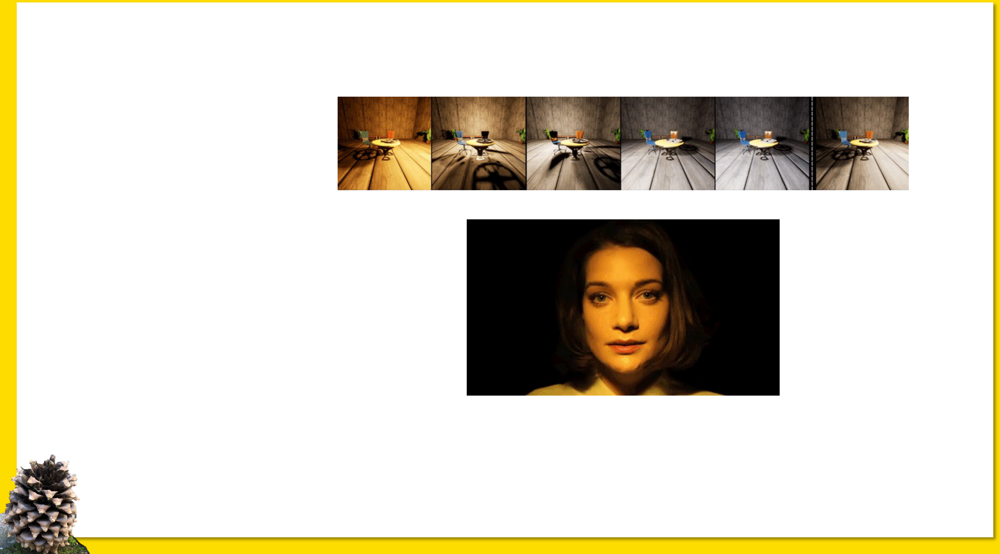{width="13.840277777777779in"
height="7.675294181977253in"}

+-----------------------------------------------------------------------+
| > 2D                                                                  |
+=======================================================================+
+-----------------------------------------------------------------------+

> -DRN
>
> -DSRN

+-----------------------------------------------------------------------+
| > -SIMBAR                                                             |
+=======================================================================+
+-----------------------------------------------------------------------+

+-----------------------------------------------------------------------+
| > 3D                                                                  |
+=======================================================================+
+-----------------------------------------------------------------------+

+-----------------------------------+-----------------------------------+
| > Neulighting\                    | Our Objective                     |
| > NeRF-OSR\                       |                                   |
| > ..                              |                                   |
+===================================+===================================+
+-----------------------------------+-----------------------------------+

+-----------------------------------------------------------------------+
| +------------------------------------------------------------------+  |
| | > 2D Relighting --DRN\                                           |  |
| | > (Deep Relighting Networks)                                     |  |
| +==================================================================+  |
| +------------------------------------------------------------------+  |
+=======================================================================+
+-----------------------------------------------------------------------+

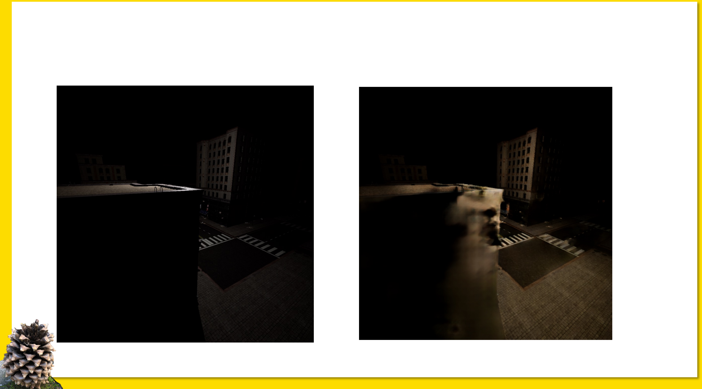{width="13.840277777777779in"
height="7.675294181977253in"}

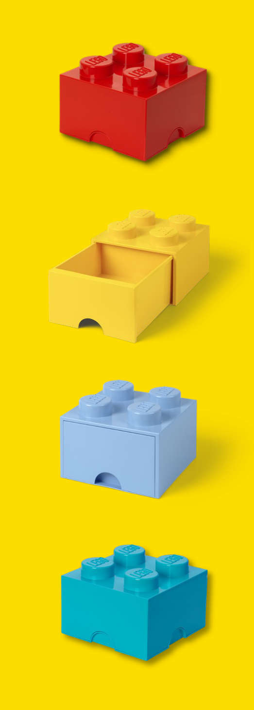{width="1.8138877952755905in"
height="5.0601574803149605in"}{width="4.3069444444444445in"
height="5.5336898512685915in"}{width="13.333333333333334in"
height="7.5in"}

> Contents\
> **NeRFactor**\
> **S3NeRF**\
> **SDPS**\
> **ARShadowGAN**

+-----------------------------------------------------------------------+
| > **NeRFactor**\                                                      |
| > Neural Factorization of Shape and Reflectance Under an Unknown      |
| > Illumination                                                        |
+=======================================================================+
+-----------------------------------------------------------------------+

{width="13.330555555555556in"
height="7.498437226596676in"}

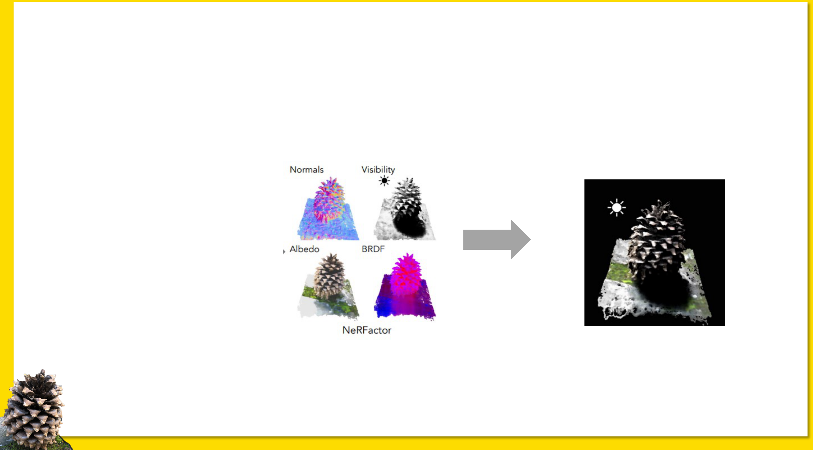{width="13.840277777777779in"
height="7.675294181977253in"}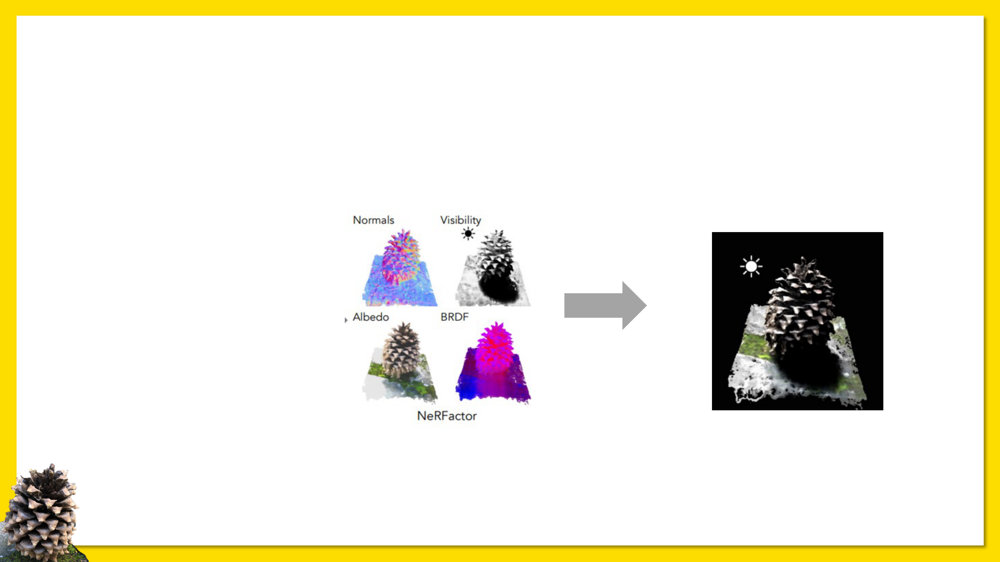{width="13.333333333333334in"
height="7.5in"}

NeRFactor\
**Input**\
- multi-view of an objected illuminated under unknown environment
lighting condition

> \- Camera poses of these images
>
> **Output**\
> - Surface normal\
> - Light Visibility\
> - Albedo\
> - Spatially -- varying BRDFs

Novel view with arbitrary lighting

> **Application of output**\
> -Relighting task: Includes removing shadow, generating shadow under
> arbitrary lighting, Reflecting under arbitrary lighting

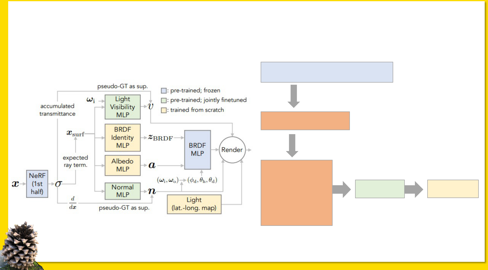{width="13.840277777777779in"
height="7.675294181977253in"}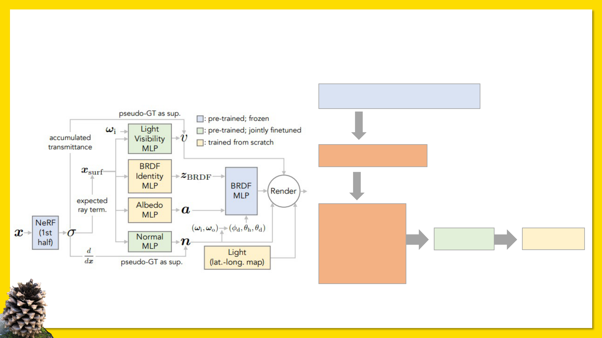{width="13.333333333333334in"
height="7.5in"}

NeRFactor Architecture\
Pretrained NeRF의 Density

Xsurf Estimation

Light visibility

+-----------------------+-----------------------+-----------------------+
| Normal                | > BRDF                | Render                |
+=======================+=======================+=======================+
| BRDF Identity         |                       |                       |
+-----------------------+-----------------------+-----------------------+

Albedo

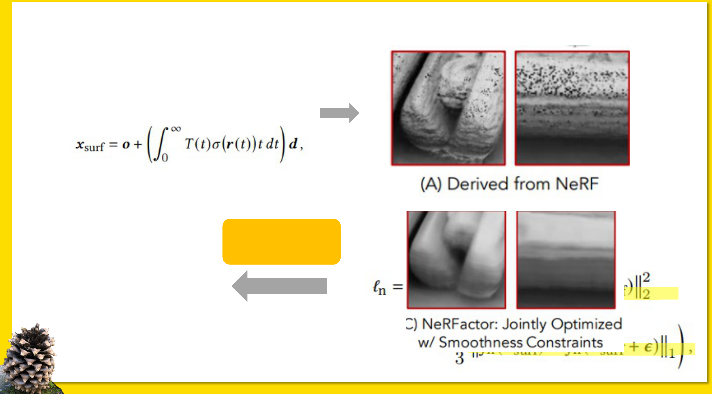{width="13.840277777777779in"
height="7.675294181977253in"}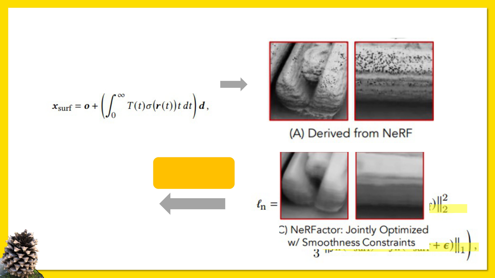{width="13.333333333333334in"
height="7.5in"}

NeRFactor\
• **Surface point (x surf )**\
(Calculate with an analytical way),

Very Noisy

**MLP**

+-----------------------+-----------------------+-----------------------+
| > **-Light            | > **Factorization**   | > **"denoised"        |
| > visibility-Normal** |                       | > surface normal** 𝒏  |
|                       |                       | > 𝒇 **:** 𝒙**surf**   |
|                       |                       | > ↦**→** 𝒏**.**       |
+=======================+=======================+=======================+
| **-BRDF Identity**    |                       |                       |
+-----------------------+-----------------------+-----------------------+
| > **-Albedo**         |                       |                       |
+-----------------------+-----------------------+-----------------------+

+-----------------------------------------------------------------------+
| +------------------------------------------------------------------+  |
| | > Factorization                                                  |  |
| +==================================================================+  |
| +------------------------------------------------------------------+  |
+=======================================================================+
+-----------------------------------------------------------------------+

{width="13.840277777777779in"
height="7.675294181977253in"}

+-----------------------------------------------------------------------+
| +------------------------------------------------------------------+  |
| | > Free-viewpoint Relighting                                      |  |
| +==================================================================+  |
| +------------------------------------------------------------------+  |
+=======================================================================+
+-----------------------------------------------------------------------+

{width="13.840277777777779in"
height="7.675294181977253in"}

+-----------------------------------------------------------------------+
| +------------------------------------------------------------------+  |
| | > Relighting                                                     |  |
| +==================================================================+  |
| +------------------------------------------------------------------+  |
+=======================================================================+
+-----------------------------------------------------------------------+

{width="13.840277777777779in"
height="7.675294181977253in"}

+-----------------------------------------------------------------------+
| > **S3NeRF**\                                                         |
| > Neural Reflectance Field from\                                      |
| > Shading and Shadow under a Single Viewpoint                         |
+=======================================================================+
+-----------------------------------------------------------------------+

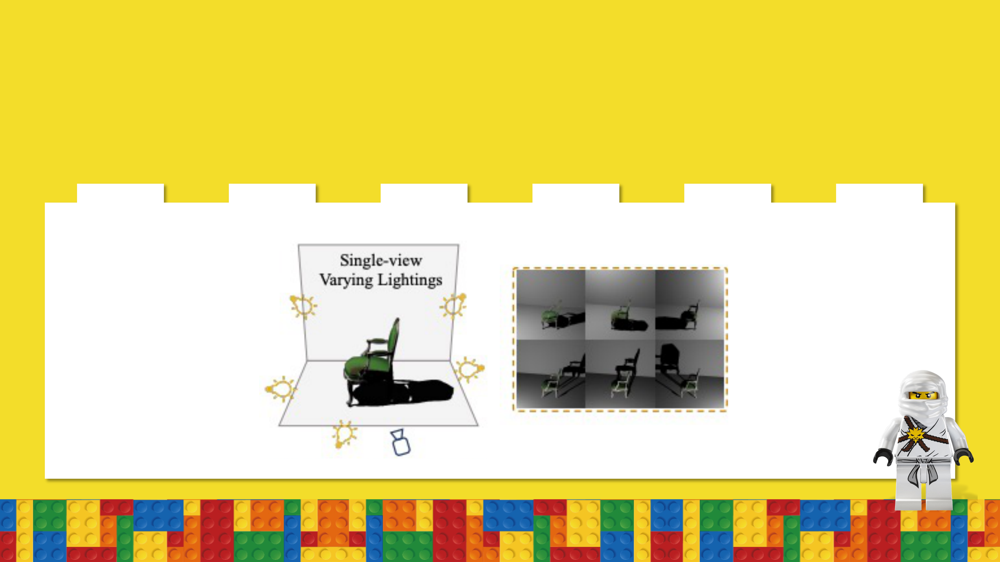{width="13.330555555555556in"
height="7.498437226596676in"}

+-----------------------------------------------------------------------+
| +------------------------------------------------------------------+  |
| | > S3NeRF Architecture                                            |  |
| +==================================================================+  |
| +------------------------------------------------------------------+  |
+=======================================================================+
+-----------------------------------------------------------------------+

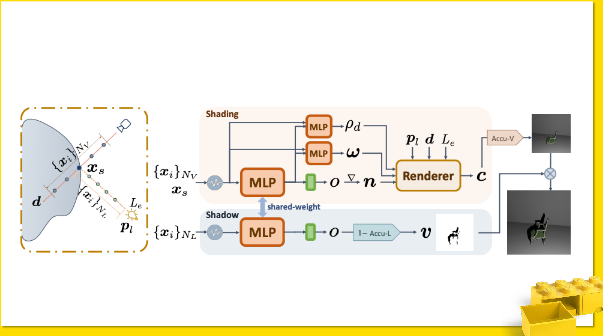{width="13.1375in"
height="7.320207786526685in"}

+-----------------------------------------------------------------------+
| +------------------------------------------------------------------+  |
| | > S3NeRF Architecture                                            |  |
| +==================================================================+  |
| +------------------------------------------------------------------+  |
+=======================================================================+
+-----------------------------------------------------------------------+

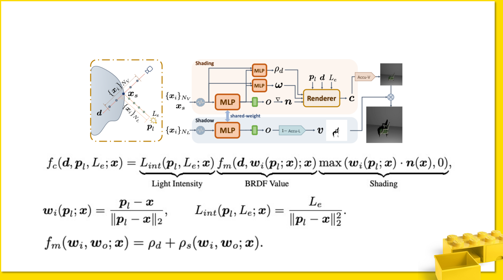{width="13.1375in"
height="7.320207786526685in"}

+-----------------------------------------------------------------------+
| +------------------------------------------------------------------+  |
| | > Alternative Shadow Modeling                                    |  |
| +==================================================================+  |
| +------------------------------------------------------------------+  |
+=======================================================================+
+-----------------------------------------------------------------------+

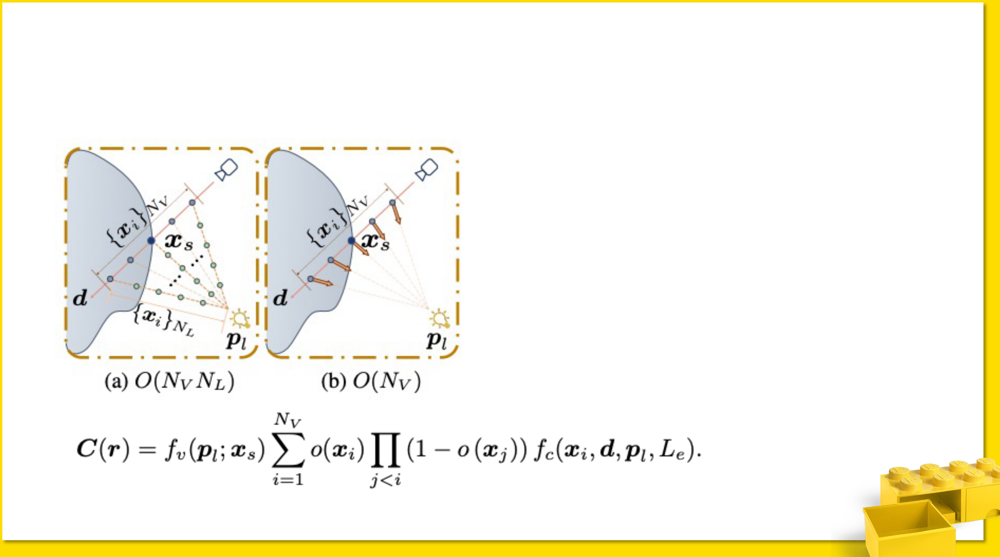{width="13.1375in"
height="7.320207786526685in"}

+-----------------------------------------------------------------------+
| +------------------------------------------------------------------+  |
| | > Results                                                        |  |
| +==================================================================+  |
| +------------------------------------------------------------------+  |
+=======================================================================+
+-----------------------------------------------------------------------+

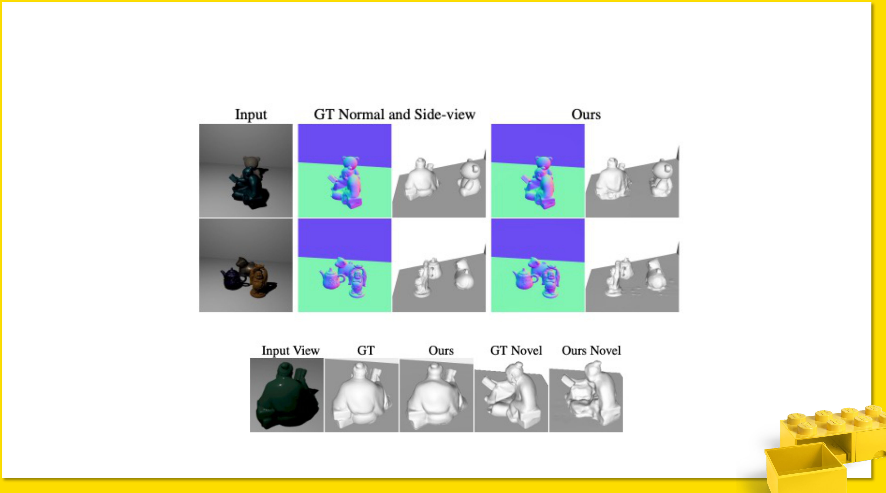{width="13.1375in"
height="7.320207786526685in"}

{width="13.330555555555556in"
height="7.498437226596676in"}

+-----------------------------------------------------------------------+
|   ------------------------------------------------------------------  |
|   Contribution                                                        |
|   ------------------------------------------------------------------  |
|                                                                       |
|   ------------------------------------------------------------------  |
+=======================================================================+
+-----------------------------------------------------------------------+

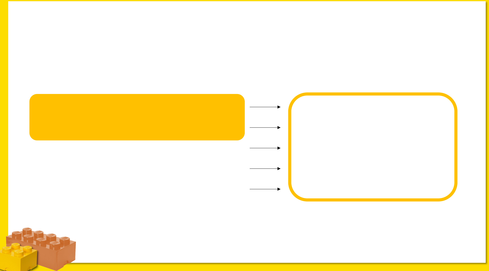{width="13.202777777777778in"
height="7.321761811023622in"}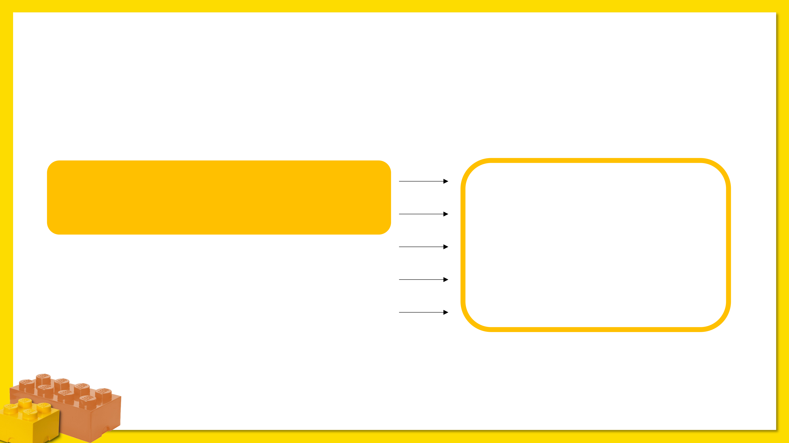{width="13.333333333333334in"
height="7.5in"}

Idea\
**Input**

+-----------------------+-----------------------+-----------------------+
| > **Preprocessing**   | > Light Position      | > S3 NeRF             |
+=======================+=======================+=======================+
|                       | Mask                  |                       |
+-----------------------+-----------------------+-----------------------+
|                       | > Camera Position     |                       |
+-----------------------+-----------------------+-----------------------+
|                       | Multi-light           |                       |
+-----------------------+-----------------------+-----------------------+

Single View

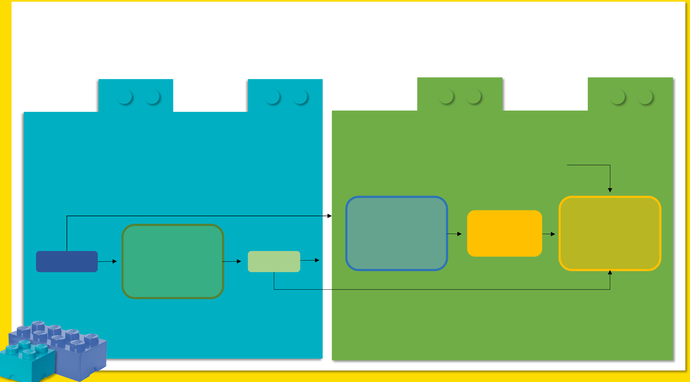{width="13.202777777777778in"
height="7.321761811023622in"}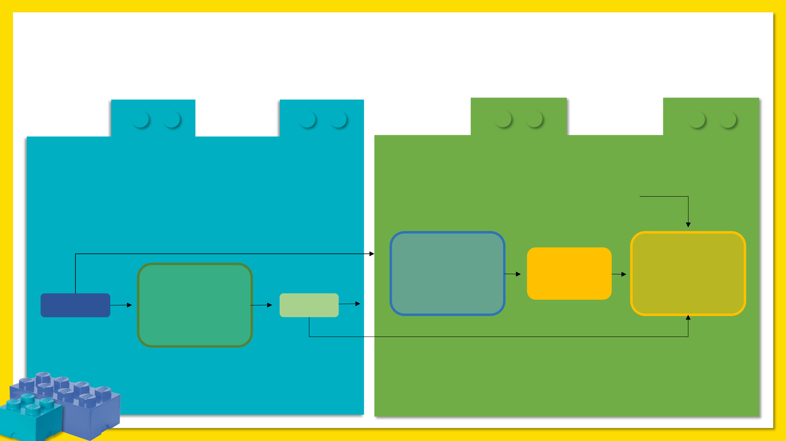{width="13.333333333333334in"
height="7.5in"}

Method

Camera Position

Multi-light

+-----------+-----------+-----------+-----------+-----------+-----------+
| > Image   | **SAM**   | > Image   | **SDPS**  | > Single  | > **S3    |
|           |           |           |           | > View    | > NeRF**  |
+===========+===========+===========+===========+===========+===========+
|           |           | > Mask    |           | Light     |           |
+-----------+-----------+-----------+-----------+-----------+-----------+
|           |           |           |           | Position  |           |
+-----------+-----------+-----------+-----------+-----------+-----------+
|           |           |           |           | Mask      |           |
+-----------+-----------+-----------+-----------+-----------+-----------+
|           | > **Stage |           |           | > **Stage |           |
|           | > 1**     |           |           | > 2**     |           |
+-----------+-----------+-----------+-----------+-----------+-----------+

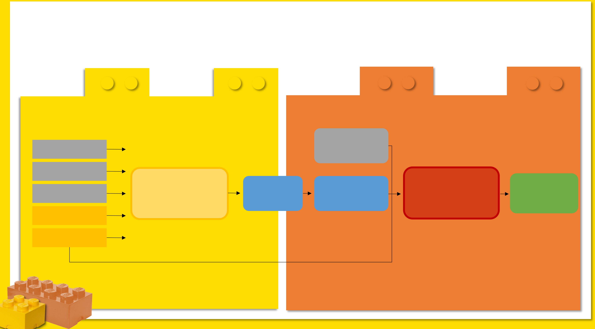{width="13.202777777777778in"
height="7.321761811023622in"}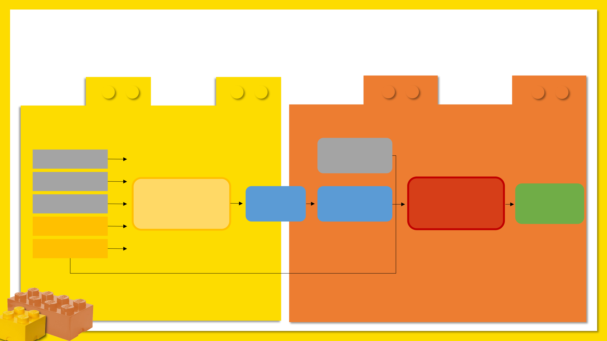{width="13.333333333333334in"
height="7.5in"}

Method

+-----------------------------------+-----------------------------------+
| > Camera Position                 | > New\                            |
|                                   | > Object                          |
+===================================+===================================+
+-----------------------------------+-----------------------------------+

> Multi-light

+-----------+-----------+-----------+-----------+-----------+-----------+
| > Single  | > **S3    | Normal,   | Shadow    | **A       | New       |
| > View    | > NeRF**  |           |           | Rshadow** | Object    |
+===========+===========+===========+===========+===========+===========+
|           |           |           | > under   |           |           |
|           |           |           | >         |           |           |
|           |           |           | Arbitrary |           |           |
+-----------+-----------+-----------+-----------+-----------+-----------+
|           |           | Novel     |           | **GAN**   | with      |
|           |           | View      |           |           | Shadow    |
+-----------+-----------+-----------+-----------+-----------+-----------+
|           |           |           | > Light   |           |           |
|           |           |           | >         |           |           |
|           |           |           | Condition |           |           |
+-----------+-----------+-----------+-----------+-----------+-----------+

> Light Position
>
> Mask

Mask

> **Stage 3** **Application**

+-----------------------------------------------------------------------+
| > **SDPS**\                                                           |
| > 2-Stage Framework for Uncalibrated Photometric Stereo               |
+=======================================================================+
+-----------------------------------------------------------------------+

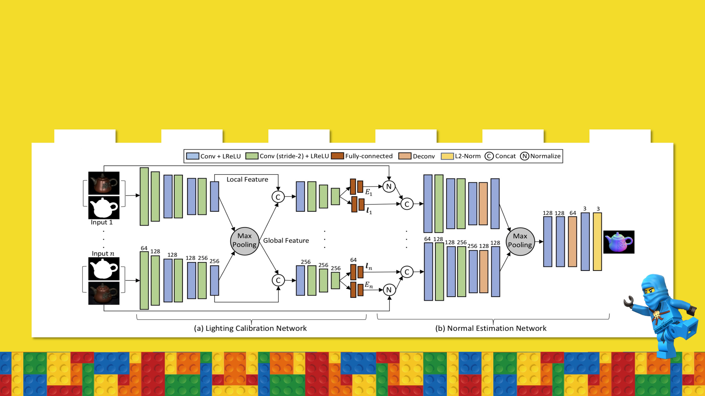{width="13.330555555555556in"
height="7.498437226596676in"}

+-----------------------+-----------------------+-----------------------+
| > SDPS LCNet          |                       |                       |
| > Architecture        |                       |                       |
+=======================+=======================+=======================+
| +------------------+  |                       |   ------------------  |
| | > Single View    |  |                       |   Light               |
| +==================+  |                       |   ------------------  |
| +------------------+  |                       |                       |
|                       |                       |   ------------------  |
+-----------------------+-----------------------+-----------------------+
| > Multi Light         |                       |                       |
+-----------------------+-----------------------+-----------------------+
|                       |                       | > Intensity           |
+-----------------------+-----------------------+-----------------------+
| > Image               |                       |                       |
+-----------------------+-----------------------+-----------------------+
|                       |                       |                       |
+-----------------------+-----------------------+-----------------------+
|   ------------------  | +------------------+  |   ------------------  |
|   Image               | | > Concat         |  |   Light               |
|   ------------------  | +==================+  |   ------------------  |
|                       | +------------------+  |                       |
|   ------------------  |                       |   ------------------  |
+-----------------------+-----------------------+-----------------------+
|                       |                       | > Direction           |
+-----------------------+-----------------------+-----------------------+
| > Mask                |                       |                       |
+-----------------------+-----------------------+-----------------------+

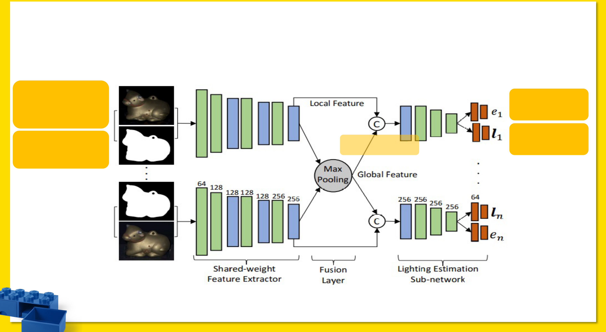{width="14.694444444444445in"
height="8.070464785651794in"}

  -----------------------------------------------------------------------
  **Local Global Feature Fusion Strategy**
  -----------------------------------------------------------------------

  -----------------------------------------------------------------------

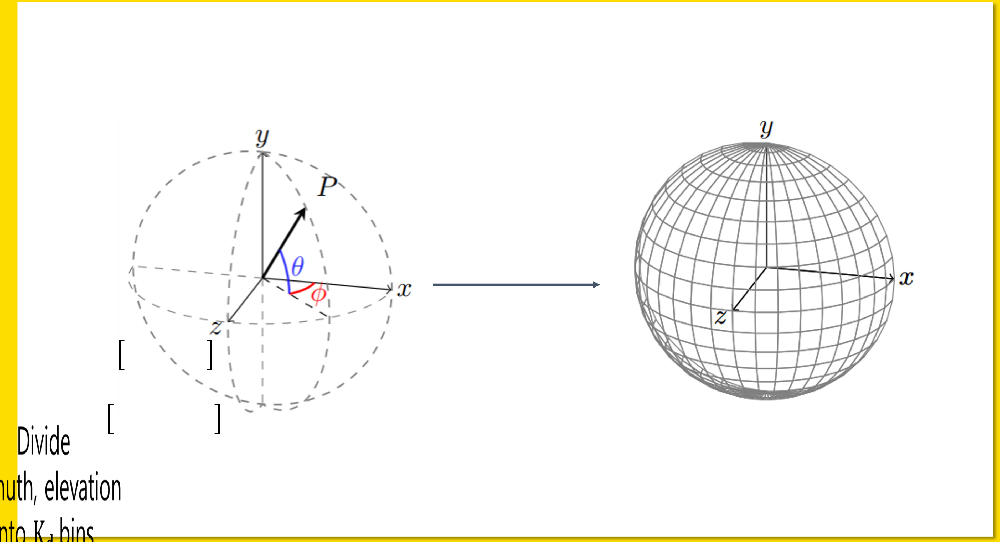{width="13.213888888888889in"
height="7.165913167104112in"}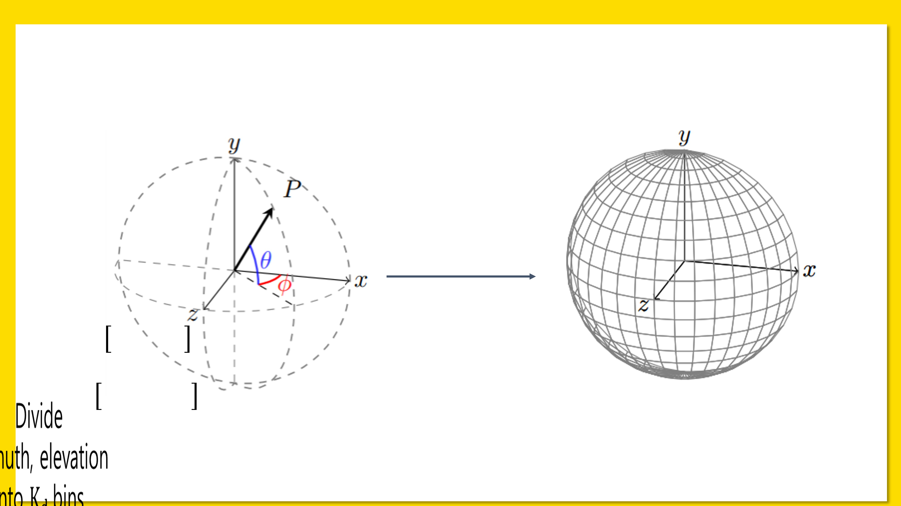{width="13.333333333333334in"
height="7.5in"}

> Classification for Light Estimation
>
> Divide\
> azimuth, elevation\
> into K! bins

Azimuth

> 𝜙 ∈ 0°, 180°

Elevation

> 𝜃 ∈ −90°, 90°
>
> **Continuous Light**\
> **Direction Space**
>
> **Discrete Light Direction Space**

+-----------------------------------------------------------------------+
| > Classification for Light Estimation\                                |
| > 1. K\" \# classes Classification Problem Softmax probability vector |
| > will have a very high dimension even when K! is not large.          |
|                                                                       |
| (e.g. K\" \# = 1,296, K\" = 36)                                       |
+=======================================================================+
+-----------------------------------------------------------------------+

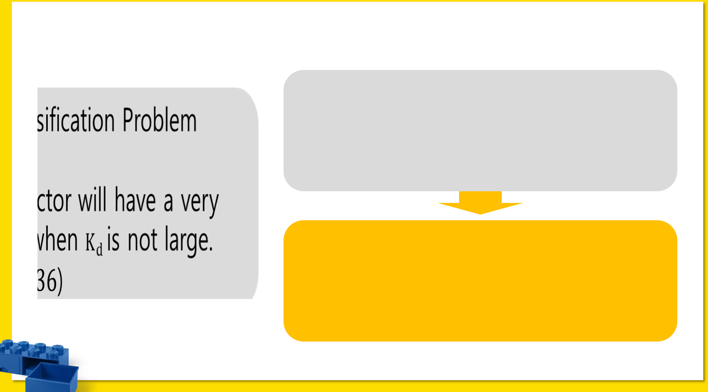{width="13.202777777777778in"
height="7.321761811023622in"}{width="0.2638888888888889in"
height="0.1388888888888889in"}{width="7.361111111111111in"
height="2.2916666666666665in"}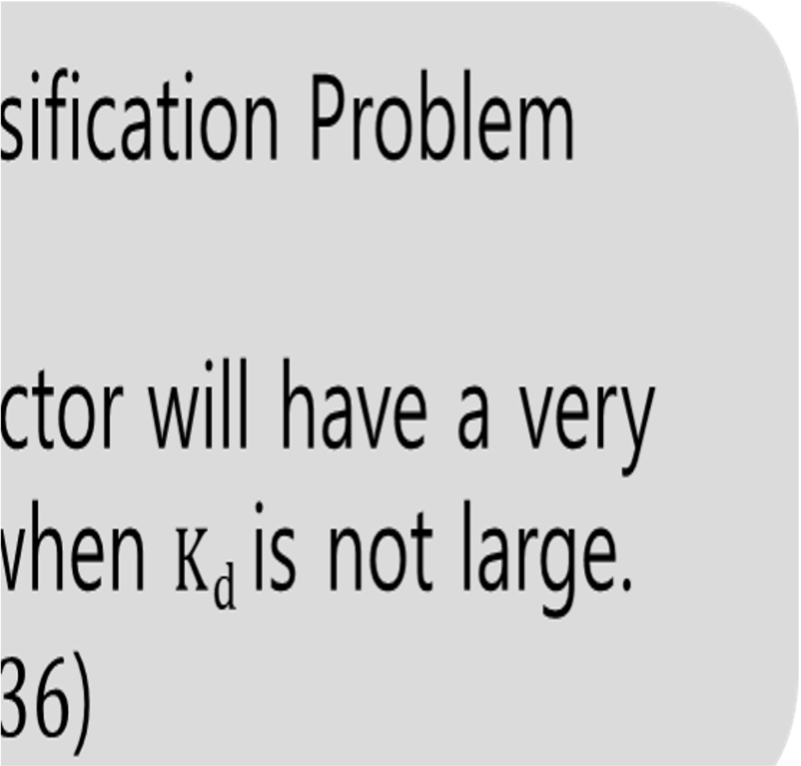{width="4.138888888888889in"
height="3.9583333333333335in"}{width="7.361111111111111in"
height="2.7222222222222223in"}

  -----------------------------------------------------------------------
  2\. 2K! classes Classification Problem
  -----------------------------------------------------------------------

  -----------------------------------------------------------------------

+-----------------------------------------------------------------------+
| > Estimate the azimuth and elevation\                                 |
| > separately                                                          |
+=======================================================================+
+-----------------------------------------------------------------------+

  -----------------------------------------------------------------------
  Similarly divide light intensities range into K\" bins
  -----------------------------------------------------------------------

  -----------------------------------------------------------------------

{width="13.330555555555556in"
height="7.498437226596676in"}

+-----------------------------------------------------------------------+
|   ------------------------------------------------------------------  |
|   TRAINING DETAILS                                                    |
|   ------------------------------------------------------------------  |
|                                                                       |
|   ------------------------------------------------------------------  |
+=======================================================================+
+-----------------------------------------------------------------------+

+-----------------------------------------------------------------------+
| > Dataset                                                             |
+=======================================================================+
+-----------------------------------------------------------------------+

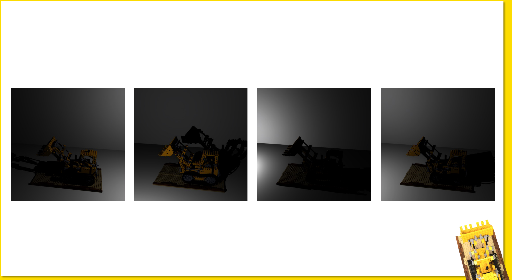{width="13.672222222222222in"
height="7.493359580052493in"}

+-----------------------------------------------------------------------+
| > NeRF-Synthesic (Lego) Augmented with Multi -- Lights                |
+=======================================================================+
+-----------------------------------------------------------------------+

+-----------------------------------------------------------------------+
| > Dataset                                                             |
+=======================================================================+
+-----------------------------------------------------------------------+

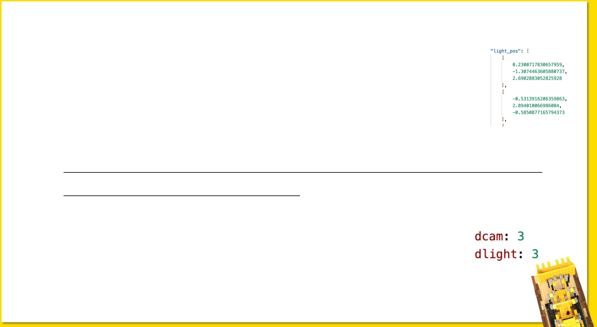{width="13.672222222222222in"
height="7.493359580052493in"}

+-----------------------------------------------------------------------+
| > NeRF-Synthesis (Lego) Augmented with Multi -- Lights                |
+=======================================================================+
+-----------------------------------------------------------------------+

+-----------------------------------------------------------------------+
| > 1\. Trained with Light Position Information                         |
+=======================================================================+
+-----------------------------------------------------------------------+

+-----------------------------------------------------------------------+
| > **2. [Trained without Light Position Information (Light Positio     |
| > ]{.underline}** **[n Estimated with SDPS-Net)]{.underline}**        |
+=======================================================================+
+-----------------------------------------------------------------------+

+-----------------------------------------------------------------------+
| > Needs rough information of object-light distance & object-camera    |
| > distance                                                            |
+=======================================================================+
+-----------------------------------------------------------------------+

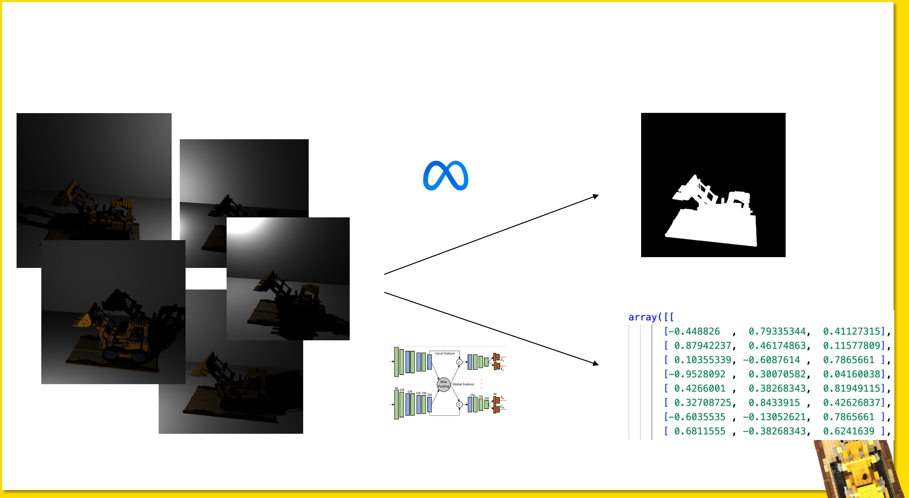{width="13.676388888888889in"
height="7.504498031496063in"}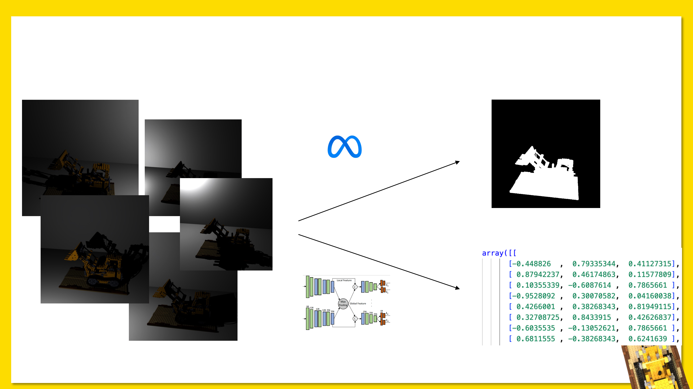{width="13.333333333333334in"
height="7.5in"}

> Training without Light Position Information (Light Position Estimated
> with SDPS-Net)

SAM

+-----------------------------------+-----------------------------------+
| 64 Images under different light   | > SDPS-Net                        |
| condition                         |                                   |
+===================================+===================================+
+-----------------------------------+-----------------------------------+

+-----------------------------------------------------------------------+
| > Training without Light Position Information (Light Position         |
| > Estimated with SDPS-Net)                                            |
+=======================================================================+
+-----------------------------------------------------------------------+

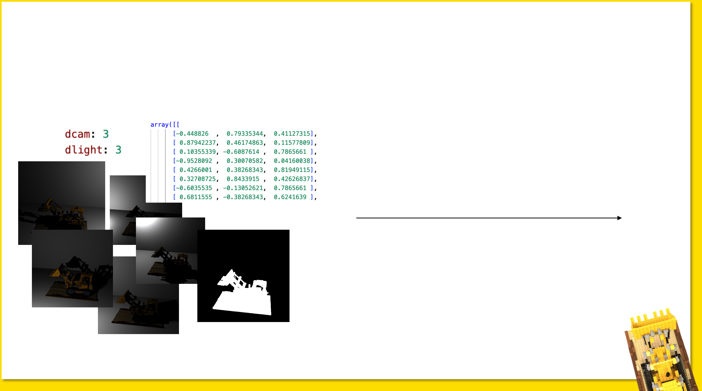{width="13.669444444444444in"
height="7.616607611548557in"}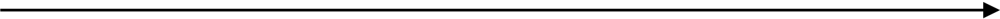{width="4.972222222222222in"
height="9.722222222222222e-2in"}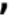{width="4.1666666666666664e-2in"
height="5.555555555555555e-2in"}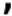{width="4.1666666666666664e-2in"
height="5.555555555555555e-2in"}{width="5.555555555555555e-2in"
height="0.125in"}{width="0.5277777777777778in"
height="0.1111111111111111in"}{width="6.944444444444445e-2in"
height="0.1111111111111111in"}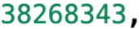{width="0.5972222222222222in"
height="0.125in"}{width="0.19444444444444445in"
height="0.1111111111111111in"}{width="0.4861111111111111in"
height="0.1111111111111111in"}{width="0.125in"
height="0.1111111111111111in"}{width="5.555555555555555e-2in"
height="0.125in"}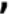{width="4.1666666666666664e-2in"
height="5.555555555555555e-2in"}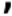{width="4.1666666666666664e-2in"
height="5.555555555555555e-2in"}{width="4.1666666666666664e-2in"
height="5.555555555555555e-2in"}{width="4.1666666666666664e-2in"
height="5.555555555555555e-2in"}{width="0.4722222222222222in"
height="0.1111111111111111in"}{width="6.944444444444445e-2in"
height="0.1111111111111111in"}{width="0.5972222222222222in"
height="0.125in"}{width="0.1388888888888889in"
height="0.1111111111111111in"}{width="0.4861111111111111in"
height="0.1111111111111111in"}{width="5.555555555555555e-2in"
height="0.125in"}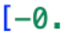{width="0.2361111111111111in"
height="0.125in"}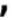{width="4.1666666666666664e-2in"
height="6.944444444444445e-2in"}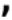{width="4.1666666666666664e-2in"
height="6.944444444444445e-2in"}{width="6.944444444444445e-2in"
height="0.1111111111111111in"}{width="0.4861111111111111in"
height="0.1111111111111111in"}{width="0.125in"
height="0.1111111111111111in"}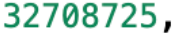{width="0.5972222222222222in"
height="0.125in"}{width="0.125in"
height="9.722222222222222e-2in"}{width="0.6527777777777778in"
height="0.125in"}{width="5.555555555555555e-2in"
height="0.125in"}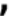{width="4.1666666666666664e-2in"
height="5.555555555555555e-2in"}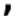{width="4.1666666666666664e-2in"
height="5.555555555555555e-2in"}{width="0.6527777777777778in"
height="0.125in"}{width="6.944444444444445e-2in"
height="0.1111111111111111in"}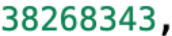{width="0.5972222222222222in"
height="0.125in"}{width="0.125in"
height="0.1111111111111111in"}{width="0.4861111111111111in"
height="0.1111111111111111in"}{width="0.125in"
height="0.1111111111111111in"}{width="5.555555555555555e-2in"
height="0.125in"}{width="4.1666666666666664e-2in"
height="5.555555555555555e-2in"}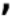{width="4.1666666666666664e-2in"
height="5.555555555555555e-2in"}{width="4.1666666666666664e-2in"
height="4.1666666666666664e-2in"}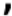{width="4.1666666666666664e-2in"
height="5.555555555555555e-2in"}{width="0.6527777777777778in"
height="0.1111111111111111in"}{width="6.944444444444445e-2in"
height="0.1111111111111111in"}{width="0.5416666666666666in"
height="0.1111111111111111in"}{width="6.944444444444445e-2in"
height="0.1111111111111111in"}{width="0.4861111111111111in"
height="0.1111111111111111in"}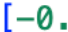{width="0.2361111111111111in"
height="0.1111111111111111in"}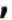{width="4.1666666666666664e-2in"
height="6.944444444444445e-2in"}{width="4.1666666666666664e-2in"
height="4.1666666666666664e-2in"}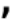{width="4.1666666666666664e-2in"
height="6.944444444444445e-2in"}{width="5.555555555555555e-2in"
height="5.555555555555555e-2in"}{width="0.4722222222222222in"
height="0.1111111111111111in"}{width="6.944444444444445e-2in"
height="0.1111111111111111in"}{width="0.4861111111111111in"
height="0.1111111111111111in"}{width="0.19444444444444445in"
height="0.1111111111111111in"}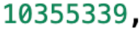{width="0.5972222222222222in"
height="0.125in"}{width="0.125in"
height="0.1111111111111111in"}{width="5.555555555555555e-2in"
height="0.125in"}{width="5.555555555555555e-2in"
height="0.125in"}{width="5.555555555555555e-2in"
height="5.555555555555555e-2in"}{width="0.1111111111111111in"
height="0.18055555555555555in"}{width="0.2222222222222222in"
height="0.16666666666666666in"}{width="0.2222222222222222in"
height="0.2222222222222222in"}{width="0.2361111111111111in"
height="0.18055555555555555in"}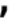{width="4.1666666666666664e-2in"
height="6.944444444444445e-2in"}{width="4.1666666666666664e-2in"
height="4.1666666666666664e-2in"}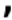{width="4.1666666666666664e-2in"
height="6.944444444444445e-2in"}{width="6.944444444444445e-2in"
height="9.722222222222222e-2in"}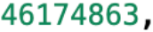{width="0.5972222222222222in"
height="0.125in"}{width="0.125in"
height="9.722222222222222e-2in"}{width="0.5555555555555556in"
height="9.722222222222222e-2in"}{width="0.125in"
height="9.722222222222222e-2in"}{width="0.5972222222222222in"
height="0.125in"}{width="5.555555555555555e-2in"
height="0.125in"}{width="6.944444444444445e-2in"
height="5.555555555555555e-2in"}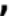{width="4.1666666666666664e-2in"
height="5.555555555555555e-2in"}{width="4.1666666666666664e-2in"
height="4.1666666666666664e-2in"}{width="4.1666666666666664e-2in"
height="5.555555555555555e-2in"}{width="6.944444444444445e-2in"
height="6.944444444444445e-2in"}{width="0.6527777777777778in"
height="0.125in"}{width="6.944444444444445e-2in"
height="0.1111111111111111in"}{width="0.5972222222222222in"
height="0.125in"}{width="6.944444444444445e-2in"
height="0.1111111111111111in"}{width="0.4166666666666667in"
height="0.1111111111111111in"}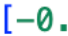{width="0.2361111111111111in"
height="0.125in"}{width="0.1111111111111111in"
height="0.16666666666666666in"}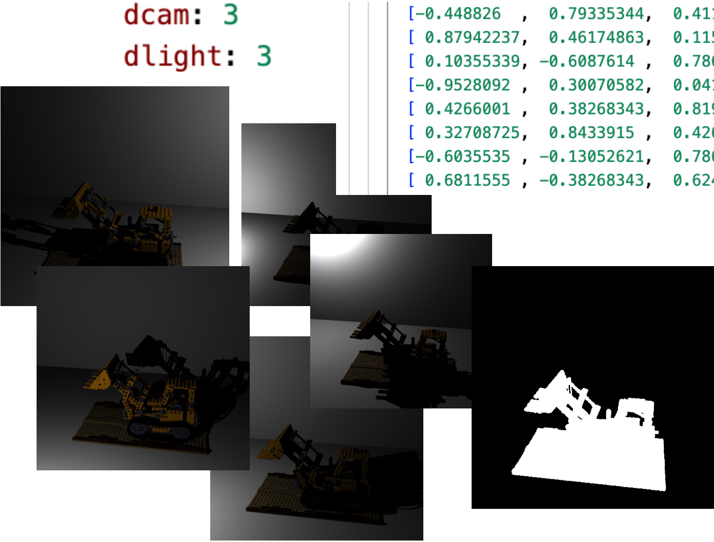{width="5.083333333333333in"
height="3.861111111111111in"}{width="0.4861111111111111in"
height="0.18055555555555555in"}{width="0.3472222222222222in"
height="0.1111111111111111in"}{width="4.1666666666666664e-2in"
height="0.125in"}{width="5.555555555555555e-2in"
height="0.125in"}{width="4.1666666666666664e-2in"
height="0.125in"}

  -----------------------------------------------------------------------
  S\^3-NeRF
  -----------------------------------------------------------------------

  -----------------------------------------------------------------------

+-----------------------------------------------------------------------+
| > 64 Images under different light condition, Object mask,\            |
| > Light Position, Object-Camera distance, Object-Light distance       |
+=======================================================================+
+-----------------------------------------------------------------------+

+-----------------------------------------------------------------------+
| +------------------------------------------------------------------+  |
| | > Training without Light Position Information (Light Position    |  |
| | > Estimated with SDPS-Net)                                       |  |
| +==================================================================+  |
| +------------------------------------------------------------------+  |
+=======================================================================+
+-----------------------------------------------------------------------+

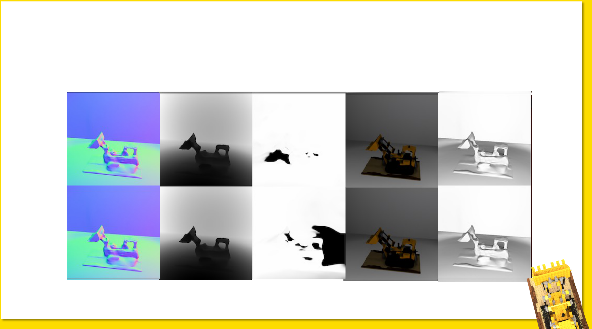{width="13.669444444444444in"
height="7.616607611548557in"}

+-----------------------------------------------------------------------+
| > **Training without Light Position Information** **(Light Position   |
| > Estimated with SDPS-Net)**                                          |
+=======================================================================+
+-----------------------------------------------------------------------+

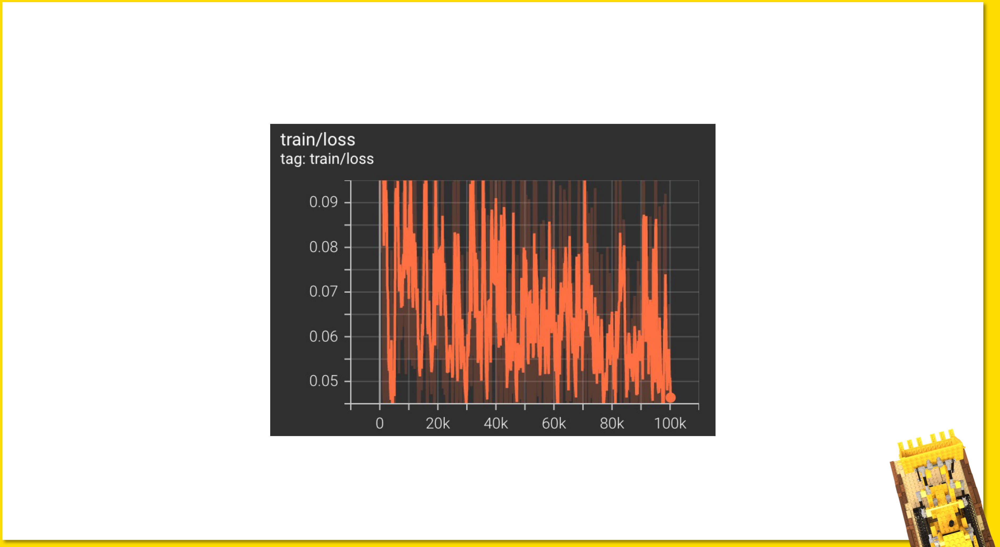{width="13.672222222222222in"
height="7.478915135608049in"}

  -----------------------------------------------------------------------
  Trained 1500 epoch (100k iters) with NVIDIA V100 GPU
  -----------------------------------------------------------------------

  -----------------------------------------------------------------------

{width="13.330555555555556in"
height="7.498437226596676in"}

+-----------------------------------------------------------------------+
|   ------------------------------------------------------------------  |
|   RESULTS                                                             |
|   ------------------------------------------------------------------  |
|                                                                       |
|   ------------------------------------------------------------------  |
+=======================================================================+
+-----------------------------------------------------------------------+

+-----------------------------------------------------------------------+
| > **Trained without Light Position Information** **(Light Position    |
| > Estimated with SDPS-Net)**                                          |
+=======================================================================+
+-----------------------------------------------------------------------+

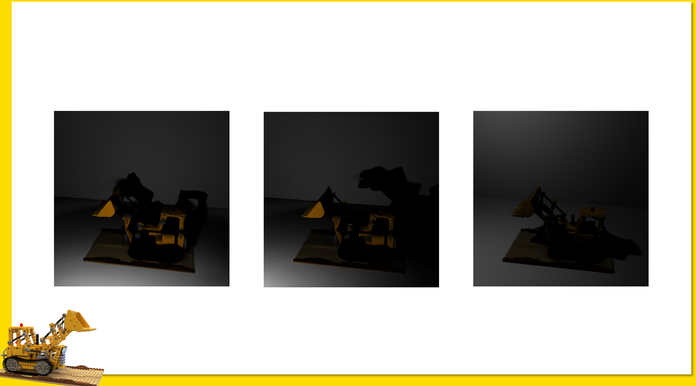{width="13.533333333333333in"
height="7.5050754593175855in"}

  -----------------------------------------------------------------------
  Relighting with Random Light Directions
  -----------------------------------------------------------------------

  -----------------------------------------------------------------------

+-----------------------------------------------------------------------+
| > **Trained without Light Position Information** **(Light Position    |
| > Estimated with SDPS-Net)**                                          |
+=======================================================================+
+-----------------------------------------------------------------------+

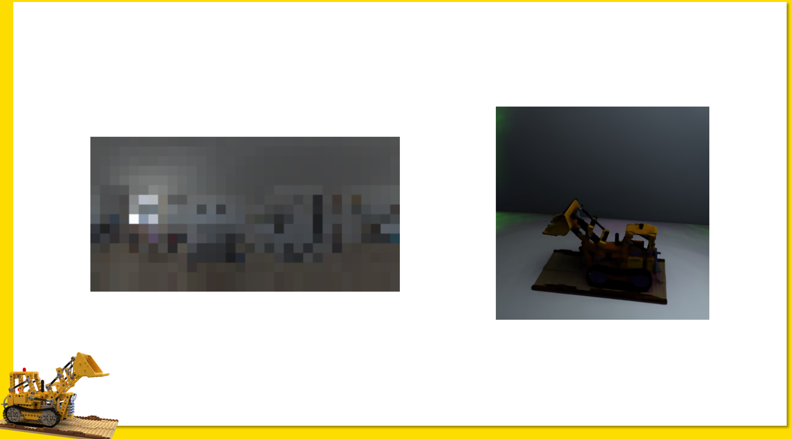{width="13.533333333333333in"
height="7.5050754593175855in"}

  -----------------------------------------------------------------------
  Relighting with HDR
  -----------------------------------------------------------------------

  -----------------------------------------------------------------------

+-----------------------------------------------------------------------+
| > **Trained without Light Position Information** **(Light Position    |
| > Estimated with SDPS-Net)**                                          |
+=======================================================================+
+-----------------------------------------------------------------------+

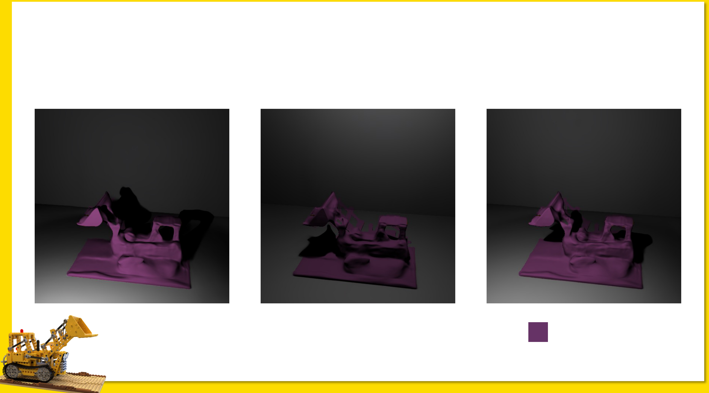{width="13.533333333333333in"
height="7.5050754593175855in"}

+-----------------------------------------------------------------------+
| > Relighting with Edited Albedo (#66335C)                             |
+=======================================================================+
+-----------------------------------------------------------------------+

+-----------------------------------------------------------------------+
| > **Trained without Light Position Information** **(Light Position    |
| > Estimated with SDPS-Net)**                                          |
+=======================================================================+
+-----------------------------------------------------------------------+

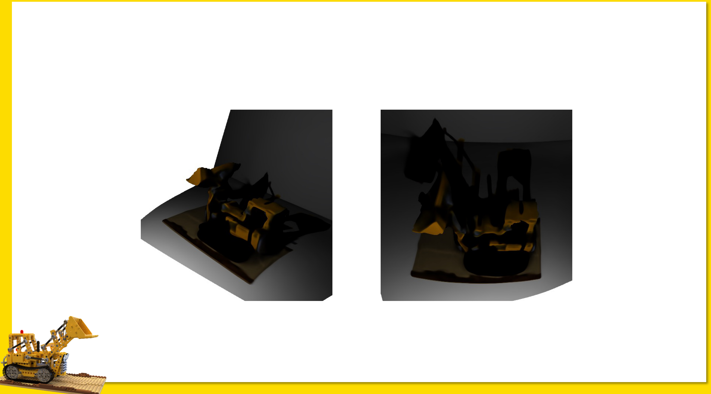{width="13.533333333333333in"
height="7.5050754593175855in"}

  -----------------------------------------------------------------------
  Novel-View Synthesis with Relighting
  -----------------------------------------------------------------------

  -----------------------------------------------------------------------

+-----------------------------------------------------------------------+
| +------------------------------------------------------------------+  |
| | > Comparing to Result Trained with 128 Light Position            |  |
| | > (Not-Estimated) (Trained 800 epoch (100k iters) with NVIDIA    |  |
| | > RTX3090)                                                       |  |
| +==================================================================+  |
| +------------------------------------------------------------------+  |
+=======================================================================+
+-----------------------------------------------------------------------+

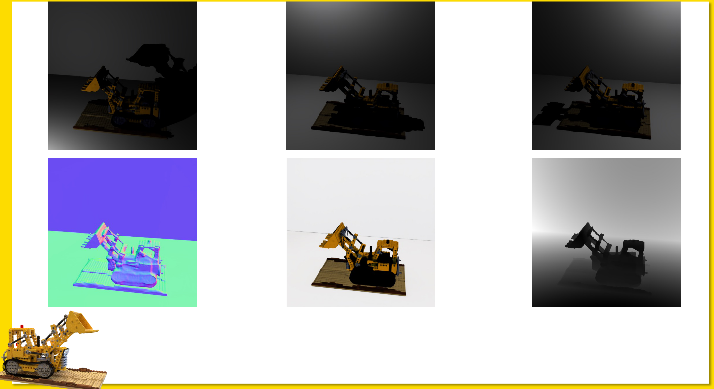{width="13.530555555555555in"
height="7.377391732283464in"}

+-----------------------------------------------------------------------+
| > **ARShadowGAN**\                                                    |
| > Shadow Generative Adversarial Network\                              |
| > For Augmented Reality in Single Light Scenes                        |
+=======================================================================+
+-----------------------------------------------------------------------+

{width="13.330555555555556in"
height="7.498437226596676in"}{width="4.1666666666666664e-2in"
height="4.1666666666666664e-2in"}{width="4.1666666666666664e-2in"
height="4.1666666666666664e-2in"}{width="4.1666666666666664e-2in"
height="4.1666666666666664e-2in"}{width="6.944444444444445e-2in"
height="4.1666666666666664e-2in"}{width="0.6944444444444444in"
height="0.5694444444444444in"}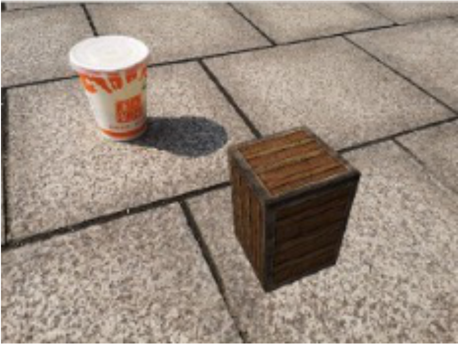{width="3.263888888888889in"
height="2.4583333333333335in"}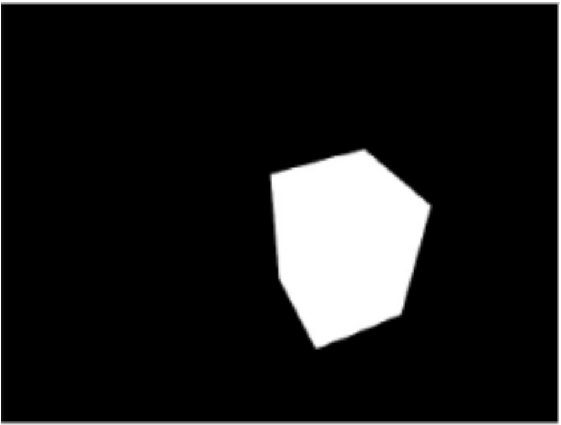{width="3.263888888888889in"
height="2.4722222222222223in"}

+-----------------------------------------------------------------------+
| +------------------------------------------------------------------+  |
| | > ARShadowGAN Model Architecture                                 |  |
| +==================================================================+  |
| +------------------------------------------------------------------+  |
+=======================================================================+
+-----------------------------------------------------------------------+

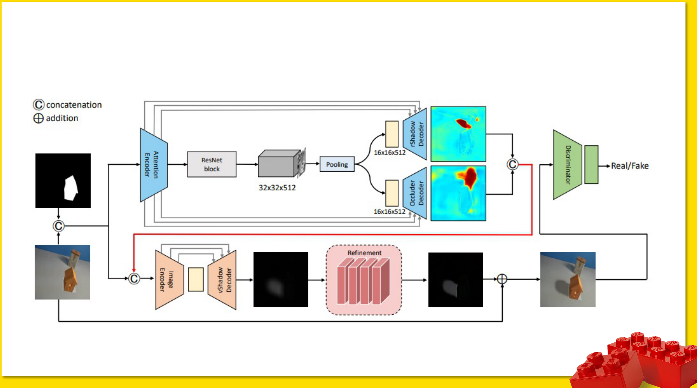{width="13.1375in"
height="7.320207786526685in"}

+-----------------------------------------------------------------------+
| +------------------------------------------------------------------+  |
| | > With Our generated data                                        |  |
| +==================================================================+  |
| +------------------------------------------------------------------+  |
+=======================================================================+
+-----------------------------------------------------------------------+

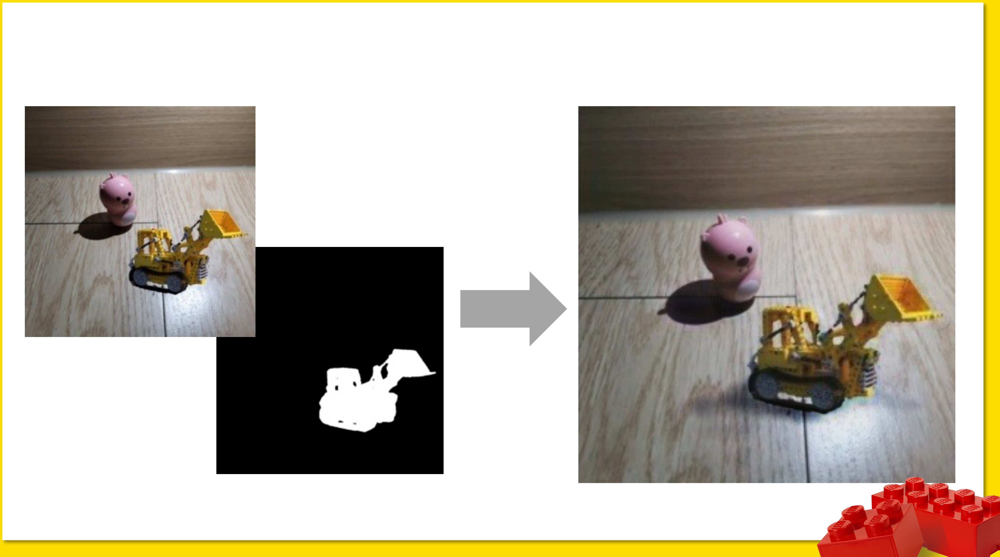{width="13.1375in"
height="7.320207786526685in"}{width="1.4166666666666667in"
height="1.0in"}{width="5.513888888888889in"
height="4.847222222222222in"}

+-----------------------------------+-----------------------------------+
| 1\.                               | > Trained under very strict       |
|                                   | > conditions                      |
+===================================+===================================+
+-----------------------------------+-----------------------------------+

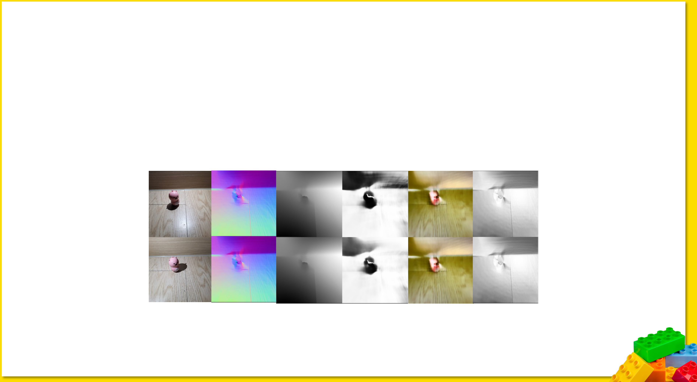{width="13.14027668416448in"
height="7.20181539807524in"}

+-----------------------------------+-----------------------------------+
| > (Every lights should be under   |                                   |
| > the same distance & intensity)  |                                   |
+===================================+===================================+
| •                                 | > Failed to Converge using Custom |
|                                   | > Dataset                         |
+-----------------------------------+-----------------------------------+

+-----------------+-----------------+-----------------+-----------------+
| +------------+  |                 |                 |                 |
| | > 2\.      |  |                 |                 |                 |
| | > Lower    |  |                 |                 |                 |
| | > quality  |  |                 |                 |                 |
| | >          |  |                 |                 |                 |
| |  comparing |  |                 |                 |                 |
| | > to       |  |                 |                 |                 |
| | > Training |  |                 |                 |                 |
| | > under    |  |                 |                 |                 |
| | > known    |  |                 |                 |                 |
| | > light    |  |                 |                 |                 |
| | > position |  |                 |                 |                 |
| +============+  |                 |                 |                 |
| +------------+  |                 |                 |                 |
+=================+=================+=================+=================+
| •               | > Presumed to   |                 |                 |
|                 | > be due to     |                 |                 |
|                 | > lack of       |                 |                 |
|                 | > access to     |                 |                 |
|                 | > accurate      |                 |                 |
|                 | > light         |                 |                 |
|                 | > information   |                 |                 |
+-----------------+-----------------+-----------------+-----------------+
| •               | > However,      |                 |                 |
|                 | > image trained |                 |                 |
|                 | > with position |                 |                 |
|                 | > still lacks   |                 |                 |
|                 | > details       |                 |                 |
|                 | > comparing to  |                 |                 |
|                 | > GT            |                 |                 |
+-----------------+-----------------+-----------------+-----------------+
| w Position      |                 | GT              | w/o Position    |
+-----------------+-----------------+-----------------+-----------------+

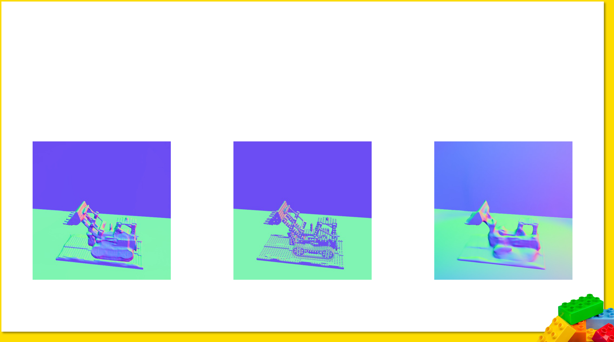{width="13.1375in"
height="7.320207786526685in"}
